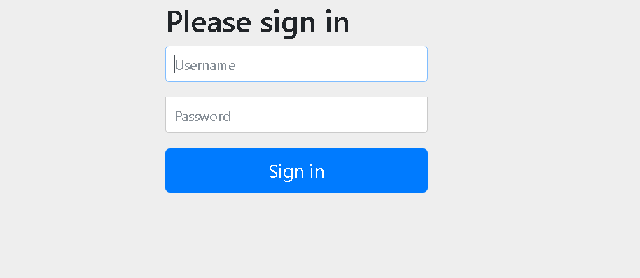
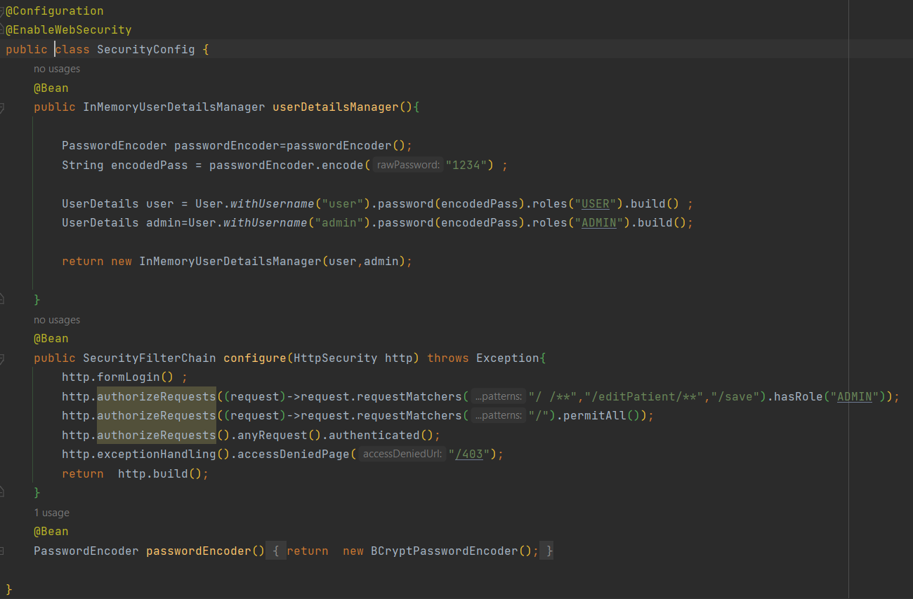
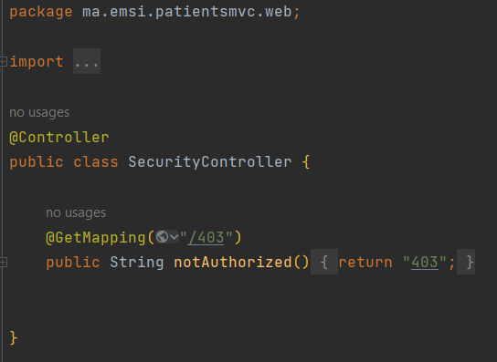
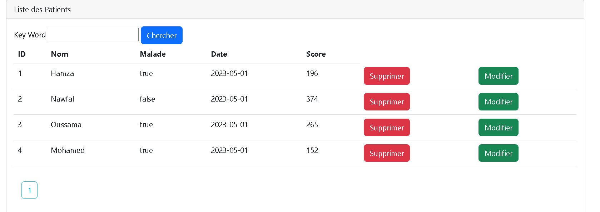
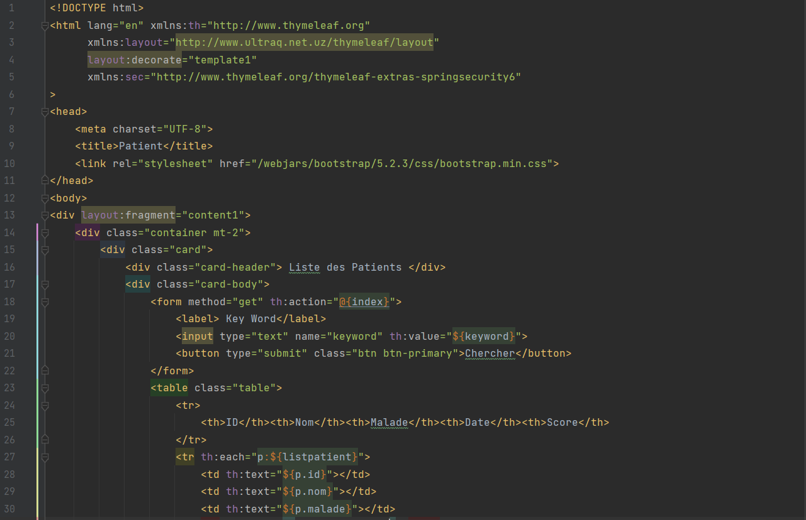
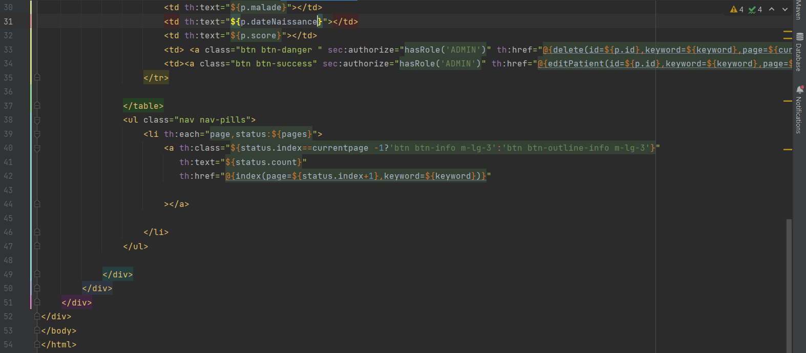
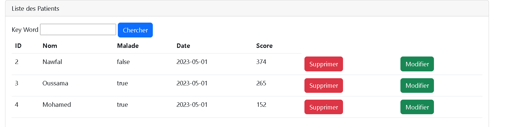
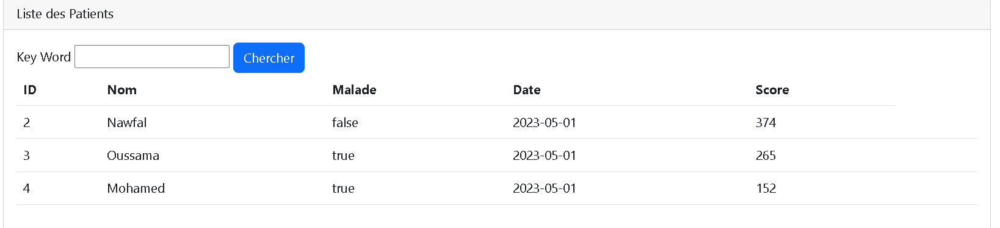
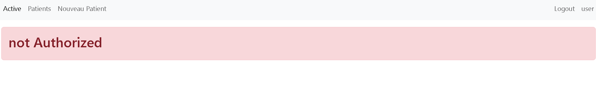
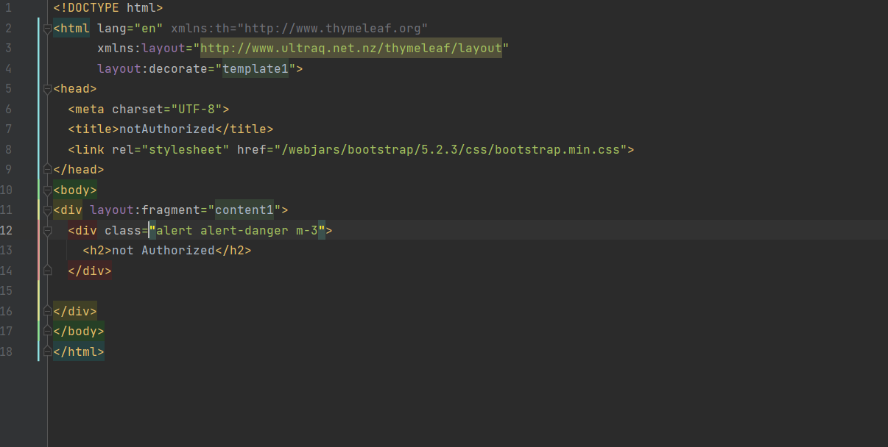

<h1>
Patient App (MVC & Spring Security)</h1>

<h4> 1- Authentification </h4>

<h4> SecurityConfig.java</h4>

<h4> SecurityController.java</h4>

<h4> 2- Main page containing list of patients (ADMIN ACCOUNT)</h4>

<h4> patients.html</h4>

<h4> 3- Deleting patient</h4>

<h4> 4- Main page containing list of patients (USER ACCOUNT)</h4>

<h4> notAuthorized page</h4>

<h4> notAuthorized.html</h4>
